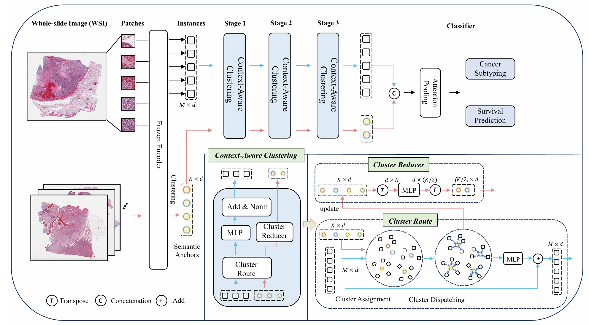

# MiCo: Multiple Instance Learning with Context-Aware Clustering for Whole Slide Image Analysis

MiCo: Multiple Instance Learning with Context-Aware Clustering for Whole Slide Image Analysis

- [English Version](#english-version)
- [中文说明](#中文说明)

---

## English Version

This repository contains the official implementation of the paper: **MiCo: Multiple Instance Learning with Context-Aware Clustering for Whole Slide Image Analysis, MICCAI2025**.

**If you have any questions, please contact: `junjianli@csu.edu.cn`.**

Multiple instance learning (MIL) has shown significant promise in histopathology whole slide image (WSI) analysis for cancer diagnosis and prognosis. However, the inherent spatial heterogeneity of WSIs presents critical challenges, as morphologically similar tissue types are often dispersed across distant anatomical regions. Conventional MIL methods struggle to model these scattered tissue distributions and capture cross-regional spatial interactions effectively. To address these limitations, we propose a novel Multiple instance learning framework with Context-Aware Clustering (MiCo), designed to enhance cross-regional intra-tissue correlations and strengthen inter-tissue semantic associations in WSIs. MiCo begins by clustering instances to distill discriminative morphological patterns, with cluster centroids serving as semantic anchors. To enhance cross-regional intra-tissue correlations, MiCo employs a Cluster Route module, which dynamically links instances of the same tissue type across distant regions via feature similarity. These semantic anchors act as contextual hubs, propagating semantic relationships to refine instance-level representations. To eliminate semantic fragmentation and strengthen inter-tissue semantic associations, MiCo integrates a Cluster Reducer module, which consolidates redundant anchors while enhancing information exchange between distinct semantic groups. Extensive experiments on two challenging tasks across nine large-scale public cancer datasets demonstrate the effectiveness of MiCo, showcasing its superiority over state-of-the-art methods.



### 1. Requirements

Our code has been tested on the following environment:

- **OS:** Ubuntu 22.04
- **GPU:** NVIDIA A100 (CUDA 11.6)
- **Python:** 3.9.0

### 2. Installation

Follow these steps to set up the environment and install the required packages.

**Step 1: Create and activate the conda environment**

We recommend using Conda to manage the dependencies.

```bash
# Create a new conda environment named "MiCo" with Python 3.9
conda create -n MiCo python=3.9.0

# Activate the newly created environment
conda activate MiCo
```

**Step 2: Install PyTorch with CUDA support**

Install the specific PyTorch version compatible with CUDA 11.6.

```bash
pip3 install torch==1.13.1+cu116 torchvision==0.14.1+cu116 -f https://download.pytorch.org/whl/cu116/torch_stable.html
```

**Step 3: Install PyTorch Geometric and related packages**

Install the required libraries for graph-based deep learning.

```bash
pip install torch-scatter==2.1.1 -f https://pytorch-geometric.com/whl/torch-1.13.1+cu116.html
pip install torch-sparse==0.6.17 -f https://pytorch-geometric.com/whl/torch-1.13.1+cu116.html
pip install torch-cluster==1.6.1 -f https://pytorch-geometric.com/whl/torch-1.13.1+cu116.html
pip install torch-spline-conv==1.2.2 -f https://pytorch-geometric.com/whl/torch-1.13.1+cu116.html
pip install torch-geometric==2.5.2
```

**Step 4: Install remaining dependencies**

Install all other necessary packages from the `requirements_MiCo.txt` file.

```bash
pip install -r requirements_MiCo.txt
```

### 3. Usage

The pipeline consists of three main stages: Feature Generation, obtaining Cluster Representations, and Feature Aggregation for downstream tasks.

#### 3.1. Feature Generation

**WSI & Label Processing**

To begin, you need to process your Whole Slide Images (WSIs) into feature vectors.

- For embedding WSIs into patch features, please follow the pipeline outlined in the **[CLAM](https://github.com/mahmoodlab/CLAM)** repository.
- For processing labels related to survival analysis (follow-up time and censorship), please refer to the methodologies described in **[PatchGCN](https://github.com/mahmoodlab/Patch-GCN)**.

The output of this stage should be a directory of `.pt` files, where each file contains the feature vectors for a single WSI.

#### 3.2. Obtain Cluster Representations

After generating patch-level features, use context-aware clustering to generate representative features for each WSI.

Run the `run_clustering.py` script with the following command:

```bash
python run_clustering.py \
    --dataset_name BLCA \
    --n_clusters 64 \
    --input_dir /path/to/your/input_pt_files \
    --output_dir /path/to/your/output_directory \
    --gpu
```

**Arguments:**

- `--dataset_name`: Name of the dataset (e.g., BRCA).
- `--n_clusters`: The number of clusters to form.
- `--input_dir`: Path to the directory containing the patch feature `.pt` files from the previous step.
- `--output_dir`: Path to the directory where the clustered feature representations will be saved.
- `--gpu`: Flag to enable GPU usage.

#### 3.3. Feature Aggregation for Downstream Tasks

Finally, use the generated cluster representations to train models for classification or survival analysis.

**For Classification tasks:**

```bash
bash script/run_cls.sh
```

**For Survival Analysis tasks:**

```bash
bash script/run_surv.sh
```

*Please ensure the shell scripts `run_cls.sh` and `run_surv.sh` are configured with the correct paths to your data and desired model parameters.*

### 4. Citation

If you find our work and this repository helpful in your research, we would appreciate it if you could cite our paper. Please use the following BibTeX entry.

```bibtex
@inproceedings{li2025mico,
  title={MiCo: Multiple Instance Learning with Context-Aware Clustering for Whole Slide Image Analysis},
  author={Junjian Li, Hulin Kuang, Jin Liu, Hailin Yue, Mengshen He, and Jianxin Wang},
  booktitle={International Conference on Medical Image Computing and Computer-Assisted Intervention},
  year={2025},
  organization={Springer}
}
```

---

## 中文说明

本代码仓库是论文 **MiCo: Multiple Instance Learning with Context-Aware Clustering for Whole Slide Image Analysis, MICCAI2025** 的官方实现。

**如有问题，请联系：`junjianli@csu.edu.cn`。**

多实例学习（Multiple Instance Learning, MIL）在全视野切片（Whole Slide Image, WSI）病理分析中的癌症诊断与预后任务中表现出巨大潜力。然而，WSI 本身存在显著的空间异质性：形态相似的组织类型常常分布在解剖结构上相距较远的区域。传统 MIL 方法难以有效建模这类分散的组织分布，也难以捕获跨区域的空间交互关系。为此，我们提出了一个结合上下文感知聚类的多实例学习框架 MiCo，用于增强跨区域的类内相关性，并强化类间的语义关联。MiCo 通过聚类得到具有判别性的形态模式，并将聚类中心作为语义锚点；通过 Cluster Route 模块，将相同组织类型但空间上分散的实例在特征空间中动态连接，从而提升跨区域语义一致性；同时通过 Cluster Reducer 模块合并冗余锚点、加强不同语义组之间的信息交互，从而缓解语义碎片化问题。在两个任务、九个大规模公开癌症数据集上的大量实验表明，MiCo 在多项指标上均优于现有方法。


### 1. 环境要求

本代码在以下环境下进行了测试：

- **操作系统（OS）**：Ubuntu 22.04
- **GPU**：NVIDIA A100（CUDA 11.6）
- **Python 版本**：3.9.0

### 2. 安装说明

按照以下步骤配置运行环境并安装依赖。

**步骤 1：创建并激活 Conda 环境**

建议使用 Conda 管理 Python 及相关依赖：

```bash
# 创建名为 "MiCo" 的 Conda 环境，Python 版本为 3.9
conda create -n MiCo python=3.9.0

# 激活新建环境
conda activate MiCo
```

**步骤 2：安装支持 CUDA 的 PyTorch**

安装与 CUDA 11.6 兼容的 PyTorch 版本：

```bash
pip3 install torch==1.13.1+cu116 torchvision==0.14.1+cu116 -f https://download.pytorch.org/whl/cu116/torch_stable.html
```

**步骤 3：安装 PyTorch Geometric 及相关包**

安装用于图神经网络的相关依赖：

```bash
pip install torch-scatter==2.1.1 -f https://pytorch-geometric.com/whl/torch-1.13.1+cu116.html
pip install torch-sparse==0.6.17 -f https://pytorch-geometric.com/whl/torch-1.13.1+cu116.html
pip install torch-cluster==1.6.1 -f https://pytorch-geometric.com/whl/torch-1.13.1+cu116.html
pip install torch-spline-conv==1.2.2 -f https://pytorch-geometric.com/whl/torch-1.13.1+cu116.html
pip install torch-geometric==2.5.2
```

**步骤 4：安装其余依赖**

通过 `requirements_MiCo.txt` 安装剩余依赖：

```bash
pip install -r requirements_MiCo.txt
```

### 3. 使用流程

整体流程包括三个主要阶段：**特征生成**、**聚类表示获取** 和 **下游任务特征聚合**。

#### 3.1 特征生成

**WSI 与标签处理**

首先需要将全视野切片（WSI）转换为 patch 级特征向量：

- WSI 嵌入为 patch 特征的流程可参考 **[CLAM](https://github.com/mahmoodlab/CLAM)** 仓库；
- 生存分析任务中关于随访时间与删失（censorship）等标签的处理，可参考 **[PatchGCN](https://github.com/mahmoodlab/Patch-GCN)** 中的相关方法。

该阶段输出应为一系列 `.pt` 文件，每个 `.pt` 文件对应一个 WSI 的特征。

#### 3.2 聚类表示获取

在获得 patch 级特征后，使用上下文感知聚类生成每个 WSI 的代表性特征表示。

通过如下命令运行 `run_clustering.py`：

```bash
python run_clustering.py \
    --dataset_name BLCA \
    --n_clusters 64 \
    --input_dir /path/to/your/input_pt_files \
    --output_dir /path/to/your/output_directory \
    --gpu
```

**主要参数说明：**

- `--dataset_name`：数据集名称，例如 BRCA；
- `--n_clusters`：聚类簇数量；
- `--input_dir`：上一阶段生成的 patch 特征 `.pt` 文件所在目录；
- `--output_dir`：保存聚类特征表示的输出目录；
- `--gpu`：是否启用 GPU 加速。

#### 3.3 下游任务特征聚合

在获得聚类表示后，可以进一步进行分类或生存分析等下游任务训练。

**分类任务：**

```bash
bash script/run_cls.sh
```

**生存分析任务：**

```bash
bash script/run_surv.sh
```

*请根据自己的数据路径和模型设置，合理修改 `run_cls.sh` 与 `run_surv.sh` 中的参数。*

### 4. 引用

如果本工作或代码仓库对您的研究有所帮助，欢迎引用我们的论文：

```bibtex
@inproceedings{li2025mico,
  title={MiCo: Multiple Instance Learning with Context-Aware Clustering for Whole Slide Image Analysis},
  author={Junjian Li, Hulin Kuang, Jin Liu, Hailin Yue, Mengshen He, and Jianxin Wang},
  booktitle={International Conference on Medical Image Computing and Computer-Assisted Intervention},
  year={2025},
  organization={Springer}
}
```

### 5. 联系方式

如对本仓库或论文有任何疑问，欢迎通过邮箱联系：**`junjianli@csu.edu.cn`**。